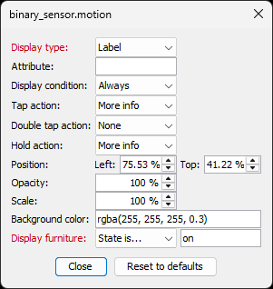

# Home Assistant Floor Plan Plugin for Sweet Home 3D

Turn your [Sweet Home 3D](https://www.sweethome3d.com/) interior design into a **live, interactive Home Assistant floor plan** — automatically rendered in 3D, with real-time state overlays for lights, sensors, binary sensors, covers, cameras, climate devices, and 20+ other entity types.

No manual image editing. No layout fiddling. Place your furniture, name it after your Home Assistant entities, click Start — and the plugin generates everything: photorealistic 3D renders, transparent overlays, and a ready-to-paste `picture-elements` YAML card.


## Features

* **Photorealistic 3D Renders** — Uses Sweet Home 3D's rendering engines (YafaRay / SunFlow) to produce high-quality images of your actual floor plan, with accurate lighting and shadows
* **Live State Overlay** — Overlays interactive icons and labels directly on top of your floor plan for lights, sensors, binary sensors, covers, cameras, climate, and 20+ HA entity types
* **Automatic YAML Generation** — Produces a `picture-elements` card YAML that's ready to paste into Home Assistant — no manual positioning required
* **Three Rendering Modes** — CSS (recommended), Room Overlay, and Complete Renders — choose the trade-off between render count and image quality
* **Per-Entity Customization** — For every detected entity, configure display type (icon / label / badge), display conditions, tap/hold actions, icon overrides, position, opacity, scale, and background color
* **Smart Light Handling** — Groups lights by room, supports RGB/dimmable lights with live color and brightness, detects spot light groups, renders all light combinations
* **Door & Window States** — Renders doors and windows open or closed based on your Home Assistant `cover` or `binary_sensor` state
* **Binary Sensor Support** — Motion detectors, presence sensors, contact sensors and more appear as state icons that show/hide based on their on/off state
* **Night-Time Rendering** — Optionally generate a second render for night, automatically switching based on the HA `sun` integration
* **Image Caching** — Skips re-rendering unchanged images so iterating on your floor plan is fast
* **Progress Tracking** — Progress bar shows exactly how many images remain

## Rendering Modes

### CSS (Recommended)

A base image is rendered with all lights off. Then one image is rendered per light source with only that light on. The browser blends them in real time — no need to pre-render every possible combination.

Best choice for most setups: fewest renders, good quality, fast iteration.

### Room Overlay

One base image plus one transparent overlay per light. Lights in the same room are pre-rendered in all combinations for accurate light interaction. Fewer renders than Complete Renders, better accuracy than CSS for interacting lights.

### Complete Renders

Renders a separate image for every possible light combination across the entire floor. Maximum quality, maximum render time. Best for small homes or when light accuracy is critical.

## How To Use The Plugin

1. Download the latest plugin from the [releases](../../releases/latest) page and install it
2. Prepare your model following the [criteria](#preparation) below
3. Open your SH3D project and position the 3D view to your desired perspective
4. Start the plugin: **Tools → Home Assistant Floor Plan**
5. Adjust the [configuration options](#configuration-options)
6. Click **Start** and wait for rendering to complete
7. Copy the `floorplan/` folder and `floorplan.yaml` to your Home Assistant `/config/www/` path
8. In Home Assistant, create a `picture-elements` card and paste the contents of `floorplan.yaml`

## Configuration Options


The configuration window lists all detected lights grouped by room. Verify the list matches your expectations before starting.

| Option | Description |
| ------ | ----------- |
| Width / Height | Output resolution of the rendered images |
| Light mixing mode | [Rendering mode](#rendering-modes) to use |
| Render time | Date/time for the render — affects sun position, intensity and color |
| Night-time render | Second render for night mode, switches automatically via the [Sun](https://www.home-assistant.io/integrations/sun/) integration |
| Renderer | YafaRay or SunFlow rendering engine |
| Image format | PNG or JPEG output |
| Quality | Low or high render quality |
| Sensitivity | \[1–100\] Pixel difference threshold for room overlay transparent backgrounds |
| Base path | HA path where floor plan images are served (default: `/local/floorplan`) |
| Output directory | Local path on your PC where images and YAML are saved |

The progress bar at the bottom tracks how many images remain.

Click any entity in the list to reveal per-entity settings.

### Entity Options

| <br>**Light options** | <br>**Binary sensor & furniture options** | <br>**Door & window options** |
| --- | --- | --- |

> [!NOTE]
> Settings that were modified from their default values are displayed in red

| Option | Applies to | Description |
| ------ | ---------- | ----------- |
| Display type | All | How the entity appears: `state-icon`, `state-label`, or `state-badge`. See [Elements](https://www.home-assistant.io/dashboards/picture-elements/#elements) |
| Icon override | All (icon mode) | Override the default entity icon, e.g. `mdi:motion-sensor` |
| Attribute | Sensors (label mode) | Show a specific entity attribute instead of the state value, e.g. `battery_level`, `unit_of_measurement` |
| Display condition | All | When to show the entity: Always, Never, Available, When On, When Off |
| Tap action | All | What happens on click. See [Tap action](https://www.home-assistant.io/dashboards/actions/#tap-action) |
| Double tap action | All | See [Double tap action](https://www.home-assistant.io/dashboards/actions/#double-tap-action) |
| Hold action | All | See [Hold action](https://www.home-assistant.io/dashboards/actions/#hold-action) |
| Position | All | Override the auto-calculated icon/label position (top/left %) |
| Opacity | All | Icon/label opacity (0–100%) |
| Scale | All | Icon/label size scale (0–100%) |
| Background color | All | CSS color string for the icon background |
| Display furniture condition | Non-light, non-door entities | Show/hide the 3D furniture object based on entity state (`always`, `state equals`, `state not equals`) |
| Open door/window condition | Doors & windows | Render door/window open or closed based on entity state |
| Always on | Lights only | Remove the light's icon and keep it always rendered as on |
| Is RGB(W)/dimmable | Lights only | Sync light color and brightness from HA (requires [config-template-card](https://github.com/iantrich/config-template-card), CSS mode only) |

  :clipboard: **Note for doors/windows:** The default state of the model in SH3D should be **closed**. Then modify the opening to how you want it to look when open.

  :warning: **Note for RGB/dimmable lights:** Only supported in CSS rendering mode.

## Preparation

* Name each light source in SH3D with its Home Assistant entity ID, e.g. `light.kitchen_ceiling`
* Only light sources that are **visible** and have **power > 0%** are rendered
* Multiple light sources controlled by the same switch (e.g. spotlights) should share the same name
* Enter a **description** on the SH3D furniture piece to use it as a tooltip in Home Assistant
* Rooms that share lighting (e.g. separated by a glass door) can be given the same room name to treat them as one
* To include state icons for sensors and other entities, set the furniture name to the Home Assistant entity ID. Supported entity types:
  * `air_quality.xxx`
  * `alarm_control_panel.xxx`
  * `assist_satellite.xxx`
  * `binary_sensor.xxx`
  * `button.xxx`
  * `camera.xxx`
  * `climate.xxx`
  * `cover.xxx`
  * `device_tracker.xxx`
  * `fan.xxx`
  * `humidifier.xxx`
  * `input_boolean.xxx`
  * `input_button.xxx`
  * `lawn_mower.xxx`
  * `light.xxx`
  * `lock.xxx`
  * `media_player.xxx`
  * `remote.xxx`
  * `sensor.xxx`
  * `siren.xxx`
  * `switch.xxx`
  * `sun.xxx`
  * `todo.xxx`
  * `update.xxx`
  * `vacuum.xxx`
  * `valve.xxx`
  * `water_header.xxx`
  * `weather.xxx`

## Binary Sensors

Binary sensors (motion detectors, door contacts, presence sensors, etc.) are fully supported. Place any 3D object in SH3D and name it `binary_sensor.your_entity_id` to include it as a state icon on your floor plan.

### Setup

1. In Sweet Home 3D, select any furniture piece and set its **name** to the HA entity ID, e.g. `binary_sensor.motion_hallway`
2. Optionally set the **description** to display as a tooltip in Home Assistant
3. The plugin auto-detects it and adds a `state-icon` element to the YAML

### Default Behavior

| Property | Binary Sensor default |
| -------- | -------------------- |
| Display type | Icon (`state-icon`) |
| Tap action | More Info (opens HA entity details popup) |
| Double tap action | None |
| Hold action | More Info |
| Position | Auto-calculated from 3D position |

> Binary sensors are pure UI overlays — they do not affect the 3D renders themselves.

### Key Options

**Display Condition** — Control when the icon appears:

* `When On`: Show icon only when sensor is triggered (ideal for motion/presence)
* `When Off`: Show icon when sensor is in normal/off state
* `Available`: Hide when entity is unavailable
* `Always`: Always visible

**Display Furniture Condition** — Show or hide the 3D furniture object itself based on sensor state. Useful for representing occupied chairs, open doors, or active equipment visually in the floor plan:

* `Always`: Furniture always visible
* `State equals [value]`: Show only when state matches
* `State not equals [value]`: Show only when state doesn't match

**Icon Override** — Use a specific MDI icon, e.g. `mdi:motion-sensor`, `mdi:door-open`, `mdi:smoke-detector`

### Entity Options Screenshot


### YAML Example

Motion sensor that only appears when triggered, with a custom icon and red background:

```yaml
- type: conditional
  conditions:
    - condition: state
      entity: binary_sensor.motion_hallway
      state: on
  elements:
    - type: state-icon
      entity: binary_sensor.motion_hallway
      title: Hallway Motion
      icon: mdi:motion-sensor
      style:
        top: 45.23%
        left: 32.67%
        border-radius: 50%
        text-align: center
        background-color: rgba(255, 0, 0, 0.5)
        opacity: 80%
        transform: translate(-50%, -50%) scale(100%)
      tap_action:
        action: more-info
      double_tap_action:
        action: none
      hold_action:
        action: more-info
```

### Comparison: Binary Sensor vs Light vs Door/Window

| Feature | Light | Door/Window | Binary Sensor |
| ------- | ----- | ----------- | ------------- |
| 3D rendering effect | ✅ Light glow | ✅ Open/closed geometry | ❌ Overlay only |
| Default display type | Icon | Icon | Icon |
| Default tap action | Toggle | Toggle | More Info |
| Always On option | ✅ | ❌ | ❌ |
| RGB/dimmable option | ✅ | ❌ | ❌ |
| Open condition | ❌ | ✅ | ❌ |
| Display Furniture Condition | ❌ | ❌ | ✅ |
| Icon Override | ✅ | ✅ | ✅ |
| Display Condition | ✅ | ✅ | ✅ |
| Position / Opacity / Scale | ✅ | ✅ | ✅ |

### Workaround: State-Dependent Icons

The plugin generates one icon per entity (no automatic on/off icon switching). To show different icons for different states, add the same entity twice with different icon overrides and display conditions:

* One furniture piece named `binary_sensor.motion_hallway` with `icon: mdi:motion-sensor` and Display Condition: `When On`
* A second furniture piece at the same position with `icon: mdi:motion-sensor-off` and Display Condition: `When Off`

## Sensors & Temperature Display

Sensors (`sensor.xxx`) are the most common way to display numerical values like temperature, humidity, CO₂, or battery levels on your floor plan.

### How Sensor Display Works

When you name a furniture piece `sensor.temperature_living_room`, the plugin automatically sets the display type to **Label** (`state-label`) — meaning the current state value is shown as text directly on the floor plan, e.g. **"21.5 °C"**.

> This is the only entity type where the default is Label instead of Icon. Every other entity type defaults to Icon.

### Sensor Setup

1. In Sweet Home 3D, place any small furniture object (e.g. a simple box) at the sensor location
2. Set its **name** to the HA entity ID, e.g. `sensor.temperature_living_room`
3. Set its **description** to use as a tooltip in Home Assistant (e.g. "Living Room Temperature")
4. The plugin auto-detects it and generates a `state-label` element — no configuration needed

### The Attribute Field

By default, the label shows the entity's **state** value. Use the **Attribute** field to show a specific attribute instead:

| Example | What it shows |
| ------- | ------------- |
| *(empty)* | Entity state — e.g. `21.5` (the number, unit comes from HA) |
| `unit_of_measurement` | Just the unit — e.g. `°C` |
| `battery_level` | Battery percentage of the sensor |
| `last_changed` | Last time the value changed |

The Attribute field is only visible in the entity options panel when Display Type is set to **Label**.

### YAML Example

A temperature sensor with default settings generates:

```yaml
- type: state-label
  entity: sensor.temperature_living_room
  title: Living Room Temperature
  style:
    top: 38.10%
    left: 55.20%
    border-radius: 50%
    text-align: center
    background-color: rgba(255, 255, 255, 0.3)
    opacity: 100%
    transform: translate(-50%, -50%) scale(100%)
  tap_action:
    action: more-info
  double_tap_action:
    action: none
  hold_action:
    action: more-info
```

With a specific attribute (e.g. `battery_level`):

```yaml
- type: state-label
  entity: sensor.temperature_living_room
  title: Living Room Temperature
  attribute: battery_level
  style:
    # ... same as above
```

### Sensor Display Tips

* Make the background transparent (`rgba(0,0,0,0)`) for a clean look without a white circle
* Reduce scale (e.g. 70%) to make the text smaller and less intrusive
* Use Display Condition **Available** to hide the label when the sensor is offline

## Suggestions

For best results:

* Set the SH3D 3D view time to **8:00 AM** and disable ceiling lights for a clean daytime render
* Use the **description field** of SH3D furniture as tooltips — they appear on hover in Home Assistant
* For **binary sensors** like motion detectors, set Display Condition to **When On** so the icon only appears when triggered
* Use **icon overrides** (`mdi:motion-sensor`, `mdi:smoke-detector`, `mdi:door-open`, etc.) for clearer, context-specific icons
* Use **Display Furniture Condition** on a seat or presence indicator to visually reflect occupancy in the 3D floor plan

When using **Room Overlay** light mixing mode:

* Use a dark background for the 3D view (can be made transparent later in an image editor)
* Close all doors between individually lit rooms

## Home Assistant Connection

The plugin can connect to your Home Assistant instance to fetch a list of all available entities. This lets you look up entity IDs directly from the plugin without switching to HA.

### Option A: Login with one click (recommended)

1. Enter your **HA URL** in the plugin window (e.g. `http://homeassistant.local:8123`)
2. Click **"Login to HA"** — your browser opens the Home Assistant login page
3. Log in to Home Assistant as usual
4. The plugin receives the access token automatically and fills it in — done

### Option B: Create a Long-Lived Access Token manually

1. Open Home Assistant in your browser
2. Click on your **profile icon** in the bottom-left corner (or go to **Settings → People → Your profile**)
3. Scroll down to **"Long-lived access tokens"**
4. Click **"Create token"**, enter a name (e.g. `SweetHome3D Plugin`), and confirm
5. **Copy the token immediately** — it will only be shown once
6. Paste it into the **HA API Token** field in the plugin

### Using the Entity List

Once the token is set, click **"Fetch entities"** to load all available entity IDs from your HA instance. The list appears in a dialog — use it as a reference when naming furniture pieces in Sweet Home 3D.

> [!NOTE]
> The token is saved in your SweetHome3D project file. Do not share your `.sh3d` project file publicly if it contains a token.

## Frequently Asked Questions

* **Where should I copy the generated files?**
  Copy the `floorplan/` folder and `floorplan.yaml` to your HA path, e.g. `/config/www`. Then reference them as `/local/floorplan/...` in the card.

* **How do I set the rendering perspective?**
  Before starting the plugin, position the SH3D 3D view to the exact angle you want rendered.

* **How do I change rendering settings (antialiasing, etc.)?**
  Before starting the plugin, go to **Create photo...** in SH3D and adjust settings. You don't need to render anything — just change the settings and close.

* **Can I work on the SH3D project while rendering?**
  No. The plugin scripts the renders one by one. Don't touch the 3D view during rendering.

* **What's the difference between `renders/` and `floorplan/`?**
  `renders/` contains raw SH3D output. `floorplan/` contains processed images ready for HA. In CSS mode they're nearly identical. In Room Overlay mode, `floorplan/` has transparent backgrounds applied.

* **What does "Use existing renders" do?**
  Skips re-rendering images that already exist in `renders/`. Useful when you've already rendered with one mode and want to switch to another without waiting for all renders again.

* **My binary sensor icon position is off — what do I do?**
  Auto-position is calculated from the 3D model position. If it's off (especially at non-standard resolutions), manually override the position in the entity options panel.

## Possible Future Enhancements

* [x] Allow selecting renderer (SunFlow/Yafaray)
* [x] Allow selecting quality (high/low)
* [x] Allow selecting date/time of render
* [x] Create multiple renders for multiple hours of the day and display in Home
      Assistant according to local time
* [x] Allow stopping rendering thread
* [X] Allow enabling/disabling/configuring state-icon
* [x] Support including sensors state-icons/labels for other items
* [ ] Support fans with animated gif/png with css3 image rotation
* [x] Make sure state-icons/labels do not overlap
* [x] Allow using existing rendered images and just re-create overlays and YAML
* [ ] After rendering is complete, show preview of overlay images
* [x] Allow overriding state-icons/labels positions, and save persistently
* [X] Allow defining, per entity, if it should be an icon or label, and save
      that persistently
* [ ] Auto-upload generated files to Home Assistant after rendering
* [ ] CLI / headless rendering mode for server-side use
